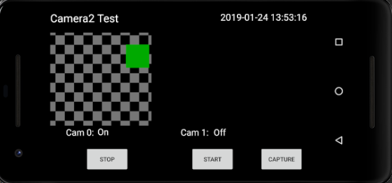
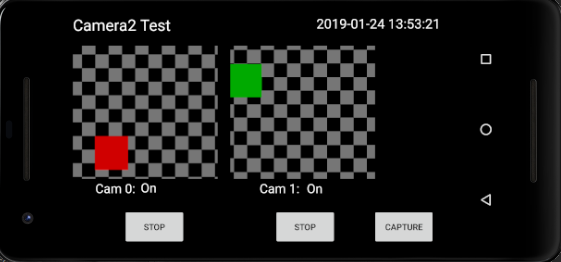
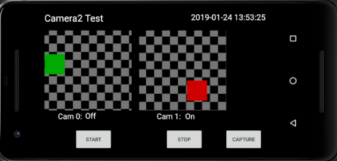
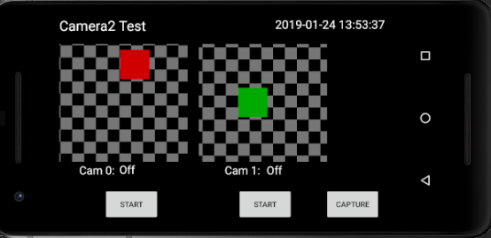

Android Camera2Basic Sample
===================================

Displays images from 2 camera sensors using camera2 API. Allows both cameras
to run and capture images simultaneously.

Originated from:
https://github.com/googlesamples/android-Camera2Basic

Features
------------

- On startup, start only Cam 0
- Tap on the Cam 0 button to start (or stop) Cam 0
- Tap on the Cam 1 button to start (or stop) Cam 1
- Freeze the image when a camera is stopped
- Allow both cameras to run simultaneously
- Tap the Capture button to save the current live image(s) to the picture library (include the
  date+time in the file name)
- Display the frames-per-second of the live camera(s) (pending)

Assumptions
-------------

- The two cameras are front and back cameras on a smartphone with camera IDs 0 and 1.
    (Ids can be extracted using android.hardware.camera2.CameraCharacteristics)
- App will only be used in landscape mode
- Saved pictures will only be viewed in landscape mode
- User has enabled 24 hour format in settings for live datetime to display in 24 hour format
- App is only tested on a pixel 2 hardware device

Notes
-----------

- FPS display feature is not added yet. It can be added using OnFrameAvailableListener to
  detect a new image frame and using elapsedRealTime() from SystemClock to measure the
  time difference between successive frames to compute the frame rate.
- Landscape mode is enforced in the manifest but reverts to portrait when app is resumed after
  switching back from the another app activity.
- App can be made more robust with some extra time.

Pre-requisites
--------------

- Android SDK 27
- Android Build Tools v27.0.2
- Android Support Repository

Screenshots
-------------

Getting Started
---------------

This sample uses the Gradle build system. To build this project, use the
"gradlew build" command or use "Import Project" in Android Studio.

Support
-------

- Google+ Community: https://plus.google.com/communities/105153134372062985968
- Stack Overflow: http://stackoverflow.com/questions/tagged/android

If you've found an error in this sample, please file an issue:
https://github.com/googlesamples/android-Camera2Basic

Patches are encouraged, and may be submitted by forking this project and
submitting a pull request through GitHub. Please see CONTRIBUTING.md for more details.

License
-------

Copyright 2017 The Android Open Source Project, Inc.

Licensed to the Apache Software Foundation (ASF) under one or more contributor
license agreements.  See the NOTICE file distributed with this work for
additional information regarding copyright ownership.  The ASF licenses this
file to you under the Apache License, Version 2.0 (the "License"); you may not
use this file except in compliance with the License.  You may obtain a copy of
the License at

http://www.apache.org/licenses/LICENSE-2.0

Unless required by applicable law or agreed to in writing, software
distributed under the License is distributed on an "AS IS" BASIS, WITHOUT
WARRANTIES OR CONDITIONS OF ANY KIND, either express or implied.  See the
License for the specific language governing permissions and limitations under
the License.
